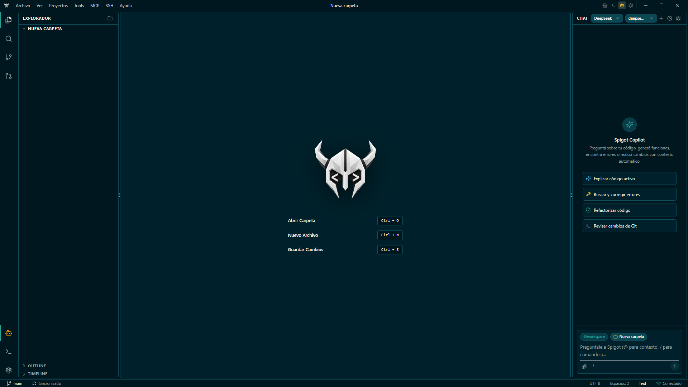

<p align="center">
  
</p>

<h1 align="center">Spigot</h1>

<p align="center">
  <strong>Editor de código premium, modular y de alto rendimiento con agentes autónomos de IA, terminal integrada y arquitectura hexagonal.</strong>
</p>

<p align="center">
  
  
  
  
  
</p>

<br>

<p align="center">
  
</p>

---

## ⚡ Resumen Rápido (Overview)

**Spigot** es un entorno de desarrollo integrado (IDE) de escritorio diseñado para maximizar la velocidad y productividad del desarrollador. Combina la flexibilidad de **Monaco Editor** con una **suite de agentes autónomos de Inteligencia Artificial** capaces de inspeccionar, editar quirúrgicamente y ejecutar código directamente dentro de tu espacio de trabajo.

---

## ✨ Características Principales (Key Features)

### 🤖 1. Modo Agente Autónomo y Copilot de IA
- **Edición Quirúrgica de Código**: Capacidad del agente para explorar el workspace (`glob_search`, `grep_search`, `read_file`), crear archivos completos (`write_file`) y aplicar parches precisos (`edit_file`).
- **Razonamiento en Tiempo Real**: Visualización plegable de bloques `<think>` y trazabilidad paso a paso de las herramientas ejecutadas.
- **Cancelación Inmediata (Stop / Abort)**: Detención instantánea del bucle del agente y salvaguardas anti-loop para evitar repeticiones innecesarias de herramientas.
- **Soporte Multimodelo y Proveedores**:
  - **OpenAI** (GPT-4o, o1, o3-mini)
  - **Anthropic** (Claude 3.5 Sonnet, Claude 3.7 Sonnet)
  - **Google Gemini** (Gemini 2.5 Pro / Flash)
  - **DeepSeek** (DeepSeek V3, DeepSeek R1)
  - **MiniMax** (MiniMax Text-01, M2.5, M2.7)
  - **Qwen**, **Kimi** y **OpenRouter** (decenas de modelos externos).
- **Autenticación Dual**: Conexión mediante **API Key** o flujo de inicio de sesión directo con **OAuth 2.0**.

### 💻 2. Terminal Integrada de Alto Rendimiento
- **Motor PTY Real**: Basado en `node-pty` y `xterm.js` con soporte para **PowerShell** en Windows, **Bash** en macOS/Linux y **SSH** para servidores remotos.
- **Portapapeles Completo**: Soporte nativo para `Ctrl+C` (copiar selección), `Ctrl+V` (pegar) y **Clic Derecho** interactivo.
- **Botón `▶ Ejecutar` Directo**: Ejecución en un clic de scripts (`.py`, `.js`, `.ts`, `.sh`, `.ps1`) directamente dentro de la consola interna de Spigot sin abrir ventanas emergentes del sistema operativo.
- **Ajuste Inteligente (ResizeObserver)**: Buffer de salida desde el milisegundo 0 y redimensión adaptativa instantánea.

### 📝 3. Editor Monaco y Lenguajes
- **LSP Integrado**: Servidores de lenguaje con autocompletado inteligente, validación de sintaxis y diagnósticos de errores en tiempo real en el panel *Problems*.
- **Pestañas y Navegador Web**: Sistema de pestañas modular con indicador de cambios (*dirty files*) y soporte para navegación web interna (`browser://`).
- **Visor de Diferencias (Diff Editor)**: Comparación visual lado a lado con Monaco DiffEditor para cambios en Git y revisiones del agente.

### 🌿 4. Control de Versiones (Git)
- Panel de control de versiones con visualización de estado (M, U, D), Staging / Unstaging, historial de commits (`git log`) y creación asistida de Pull Requests.en 

---

## 🚀 Inicio Rápido (Quick Start)

### Requisitos Previos
- **Node.js**: `v22.14.0` o superior.
- **pnpm**: Gestor de paquetes recomendado (habilitado vía Corepack).

```bash
# 1. Clonar el repositorio
git clone https://github.com/Spigot/spigot.git
cd spigot

# 2. Habilitar corepack e instalar dependencias
corepack enable
pnpm installquier

# 3. Iniciar la aplicación en modo desarrollo
pnpm run dev
```

### Compilar para Producción (Build)

```bash
# Genera los ejecutables e instaladores en la carpeta /release
pnpm run build
```

---

## ⌨️ Atajos de Teclado Globales (Shortcuts)

| Atajo | Acción |
|---|---|
| `Ctrl + +` / `Ctrl + =` | Acercar interfaz (Zoom In) |
| `Ctrl + -` | Alejar interfaz (Zoom Out) |
| `Ctrl + 0` | Restablecer tamaño predeterminado (Zoom Reset) |
| `Ctrl + \`` / `Ctrl + J` | Conmutar Consola / Terminal integrada |
| `Ctrl + B` | Conmutar Barra Lateral (Sidebar) |
| `Ctrl + S` | Guardar archivo actual |

---

## 🛠️ Stack Tecnológico

| Capa | Tecnología |
|---|---|
| **Plataforma de Escritorio** | [Electron](https://www.electronjs.org/) |
| **Frontend & UI** | [React 18](https://react.dev/), [Vite](https://vitejs.dev/), [Tailwind CSS](https://tailwindcss.com/) |
| **Editor de Código** | [Monaco Editor](https://microsoft.github.io/monaco-editor/) + LSP Bridge |
| **Terminal PTY** | [xterm.js](https://xtermjs.org/) & [node-pty](https://github.com/microsoft/node-pty) |
| **Gestión de Estado** | [Zustand](https://github.com/pmndrs/zustand) |
| **Tipado y Calidad** | TypeScript & Vitest |

---

## 🛡️ Seguridad y Aislamiento

- **IPC Seguro y Context Isolation**: Renderizado completamente aislado de Node.js mediante `preload/index.ts` y `contextBridge`.
- **Almacenamiento Local de Credenciales**: Las claves de API y tokens OAuth se guardan localmente en el almacenamiento seguro de tu máquina.
- **Cadena de Suministro**: Verificación de dependencias con bloqueo estricto (`--frozen-lockfile`) y políticas descritas en [SECURITY.md](SECURITY.md).

---

## 💖 Agradecimientos (Acknowledgements)

Este proyecto se apoya en el trabajo y las herramientas creadas por **[Gentleman-Programming](https://github.com/Gentleman-Programming/)**, agradeciendo su gran aporte al ecosistema de desarrollo y herramientas para agentes de IA:
- **Engram**: Gestión persistente de memoria y contexto para agentes.
- **Gentle AI**: Ecosistema para orquestación de agentes inteligentes y flujos de revisión.

---

<p align="center">
  <sub>Construido con pasión para una experiencia de programación veloz, autónoma e intuitiva.</sub>
</p>